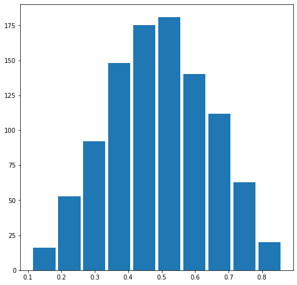
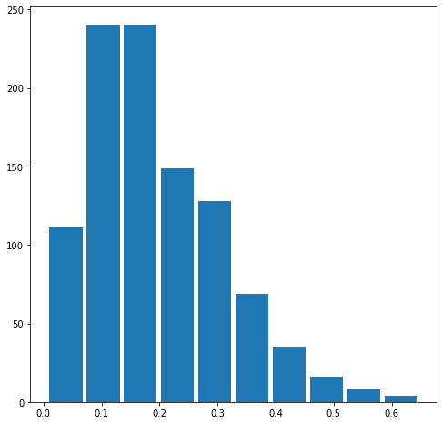
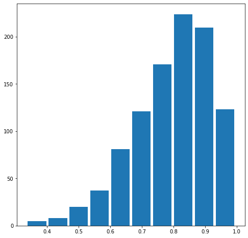
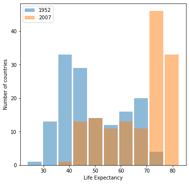
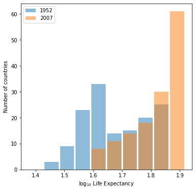
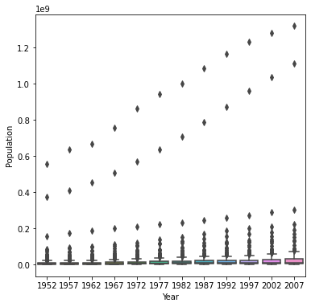
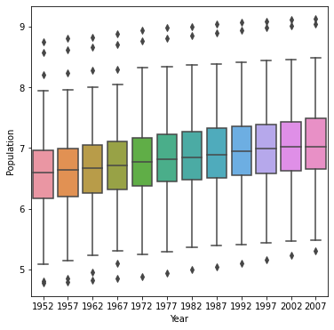

# Project 2
## Lucy Greenman

## Question 1
### Describe continuous, ordinal and nominal data. Provide examples of each.
Continuous data are numerical and occur across a range. Anything that changes incrementally is continuous data, such as the temperature outside, my age, or the number of hours that have passed since New Years 2000. Ordinal data are also numerical, but they are more concerned with the order in which they occur than with the values themselves. Rankings are ordinal data, such as class rank or a ranked-choice vote. Nominal data is not numerical, but rather consists of names, labels, or categories. The names of all the students in the class would be nominal data, as would ne the name of the state which each of us lives in.

### Describe a model of your own construction that incorporates variables of each type of data. You are perfectly welcome to describe your model using english rather than mathematical notation if you prefer. Include hypothetical variables that represent your features and target.
Let's say I'm trying to evaluate the relationship between a remote student's distance from Williamsburg during the Spring 2021 semester and the letter grade that they earn in DATA 146. In this case, the feature is distance from Williamsburg (which varies for each student), and the target is their grade (this might be correlated with distance). Distance from Williamsburg would be a continuous variable, since it is numerical and incremental. Letter grade is categorical since it is represented with a label rather than a number, but it is also ordinal in that A is clearly higher than B, B higher than C, and so on. The name of the town where each student resides could also be attached to the data as a categorical representation of location.

## Question 2
### Comment out the seed from your randomly generated data set of 1000 observations and use the beta distribution to produce a plot that has a mean that approximates the 50th percentile.


```python
import numpy as np
n = 1000
a = 5.0
b = 5.0

#np.random.seed(146)
x1 = np.random.beta(a, b, size=n)

import matplotlib.pyplot as plt
plt.figure(figsize=(8, 8))
plt.hist(x1, rwidth=0.9)
plt.show()

mean1 = np.mean(x1)
median1 = np.median(x1)
print("The mean is "+str(mean1)+".")
print("The median is "+str(median1)+".")
```


    

    


    The mean is 0.49187385260651606.
    The median is 0.4905356820841425.


### Also produce both a right skewed and left skewed plot by modifying the alpha and beta parameters from the distribution. Be sure to modify the widths of your columns in order to improve legibility of the bins (intervals). Include the mean and median for all three plots.


```python
n = 1000
a = 2.0
b = 8.0

#np.random.seed(146)
x2 = np.random.beta(a, b, size=n)

import matplotlib.pyplot as plt
plt.figure(figsize=(8, 8))
plt.hist(x2, rwidth=0.9)
plt.show()

mean2 = np.mean(x2)
median2 = np.median(x2)
print("The mean is "+str(mean2)+".")
print("The median is "+str(median2)+".")
```


    

    


    The mean is 0.19481817832741233.
    The median is 0.17276231730476235.


```python
n = 1000
a = 8.0
b = 2.0

#np.random.seed(146)
x3 = np.random.beta(a, b, size=n)

import matplotlib.pyplot as plt
plt.figure(figsize=(8, 8))
plt.hist(x3, rwidth=0.9)
plt.show()

mean3 = np.mean(x3)
median3 = np.median(x3)
print("The mean is "+str(mean3)+".")
print("The median is "+str(median3)+".")
```


    

    


    The mean is 0.7962899834253547.
    The median is 0.8169509494635234.


## Question 3
### Using the gapminder data set, produce two overlapping histograms within the same plot describing life expectancy in 1952 and 2007. Plot the overlapping histograms using both the raw data and then after applying a logarithmic transformation (np.log10() is fine).


```python
import pandas as pd
df = pd.read_csv('gapminder.tsv', sep='\t')

min_year = df['year'].min()
max_year = df['year'].max()

min_life = df['lifeExp'].min()
max_life = df['lifeExp'].max()

n_bins = 10

my_bins = np.linspace(min_life, max_life, n_bins + 1)

idx_min_year = df['year'] == min_year
idx_max_year = df['year'] == max_year

df_min_year = df[idx_min_year]
df_max_year = df[idx_max_year]

plt.figure(figsize=(6, 6))
plt.hist(df_min_year['lifeExp'], rwidth=0.9,
         label=min_year, alpha=0.5, bins=my_bins)
plt.hist(df_max_year['lifeExp'], rwidth=0.9,
         label=max_year, alpha=0.5, bins=my_bins)
plt.xlabel('Life Expectancy')
plt.ylabel('Number of countries')
plt.legend()
plt.show()
```


    

    


```python
min_year = df['year'].min()
max_year = df['year'].max()

min_life = np.log10(df['lifeExp'].min())
max_life = np.log10(df['lifeExp'].max())

n_bins = 10

my_bins = np.linspace(min_life, max_life, n_bins + 1)

idx_min_year = df['year'] == min_year
idx_max_year = df['year'] == max_year

df_min_year = df[idx_min_year]
df_max_year = df[idx_max_year]

plt.figure(figsize=(6, 6))
plt.hist(np.log10(df_min_year['lifeExp']), rwidth=0.9,
         label=min_year, alpha=0.5, bins=my_bins)
plt.hist(np.log10(df_max_year['lifeExp']), rwidth=0.9,
         label=max_year, alpha=0.5, bins=my_bins)
plt.xlabel('$\log_{10}$ Life Expectancy')
plt.ylabel('Number of countries')
plt.legend()
plt.show()
```


    

    


### Which of the two resulting plots best communicates the change in life expectancy amongst all of these countries from 1952 to 2007?
The plot under the logarithmic transformation offers a much clearer picture of the change in life expectancy across countries from 1952 to 2007.

## Question 4
### Using the seaborn library of functions, produce a box and whiskers plot of population for all countries at the given 5-year intervals.


```python
import seaborn as sns
plt.figure(figsize=(6, 6))
sns.boxplot(x=df['year'], y=df['pop'])
plt.ylabel('Population')
plt.xlabel('Year')
plt.show()
```


    

    


### Also apply a logarithmic transformation to this data and produce a second plot.


```python
log_pop = np.log10(df['pop'])

plt.figure(figsize=(6, 6))
sns.boxplot(x=df['year'], y=(log_pop))
plt.xlabel('Year')
plt.ylabel('Population')
plt.show()
```


    

    


### Which of the two resulting box and whiskers plots best communicates the change in population amongst all of these countries from 1952 to 2007?

Once again, the logarithmic data is just more intuitive to interpret. The outliers in the untransformed graph dominate the visual representation, changing the scale of the y-axis so that even seeing most of the data is almost impossible. The logarithmic translation clarifies the visual representation of change in population amongst all countries from 1952 to 2007.


```python

```
